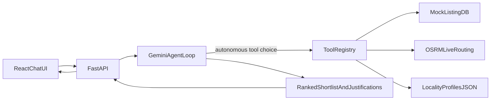

# System Architecture

## Overview

Autonomous property-discovery agent for Indian home buyers. The user chats in natural language; Gemini decides which tools to invoke; results are combined into a ranked shortlist with justifications.

## Flow diagram



## Agent loop (ReAct pattern)

1. User message appended to session history
2. Gemini receives system prompt + history + tool declarations
3. If Gemini returns function calls → execute tools → append results → goto 2
4. If Gemini returns text → send reply to user

Max 8 tool iterations per turn. Session history trimmed to last 12 turns.

## Tools

| Tool | Input | Output | Data source |
|------|-------|--------|-------------|
| `search_properties` | city, budget, BHK, locality, tags | Matching listings | `data/listings.json` |
| `get_property_details` | property_id | Full property record | `data/listings.json` |
| `estimate_commute` | origin (property/locality), destination | Duration km/min | **Live OSRM** + Nominatim |
| `get_neighbourhood_profile` | city, locality | Schools, safety, metro | `data/neighbourhoods.json` |
| `compare_properties` | property_ids[], criteria | Side-by-side table | Listings + neighbourhoods |

## Tech stack

- **Frontend:** React 19 + Vite + TypeScript + react-markdown
- **Backend:** FastAPI + Python 3.11+
- **LLM:** Google Gemini 2.0 Flash (`google-genai` SDK)
- **Routing:** OSRM public API
- **Hosting:** Render (single service serves API + static React build)

## Deployment topology

```
Render Web Service
├── Build: pip install + npm run build
├── Start: uvicorn app.main:app
├── Serves: /api/* (FastAPI) + /* (React SPA from frontend/dist)
└── Env: GEMINI_API_KEY
```
